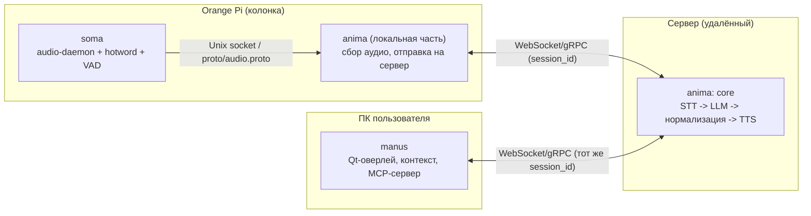

# Архитектура Otoria

## Архитектура

Звёздочная архитектруа: сервер - центр, колонка (`soma`+`anima` на Orange Pi) и десктоп-агент (`manus`) - два независимых клиента, связанные общим `session_id`. Десктоп имеет свой канал к серверу без необходимости гонять через колонку.

## Поток данных (voice path)

1. **soma**: микрофон -> ring buffer -> start/stop word-детектор -> VAD (тишина > 800 мс = конец фразы) -> PCM-кадры в Unix-сокет (TODO: изменить по мере решения ADR-0001).
2. **anima (на Orange Pi)**: читает сокет (TODO: изменить по мере решения ADR-0001) -> пакует в `proto/audio.proto` -> шлёт по WebSocket (TODO: изменить по мере решения ADR-0002) на сервер.
3. **anima (сервер)**: STT -> сбор контекста (при необходимости запрашивает у `manus` активное окно/файл/скриншот через тот же `session_id`) -> запрос в LLM API (вызов фукнкции / MCP) -> либо инструкции десктопу, либо сразу ответ.
4. **Нормализация речи**: текст от LLM -> модуль нормализации (формулы -> слова, расстановка пауз/интонации) -> TTS -> аудио-кадры обратно в `soma` на воспроизведение.
5. **manus**: получает инструкции от `anima` (например, "открыть VS Code", "сделать скриншот"), выполняет и возвращает результат по тому же каналу.

## Границы модулей

| Модуль | Отвечает за | 
|---|---|
| `soma` | Железо, звук до PCM-потока, hotword, VAD |
| `anima` | Всё от сокета/сети и дальше: STT, LLM, TTS, DevOps, протоколы |
| `manus` | Всё на ПК пользователя: UI, контекст, выполнение системных команд |

## Контракты (`proto/`)

- `proto/audio.proto` - формат аудио-кадра `soma -> anima` (частота дискретизации, кодек, флаги VAD, стоп/старт слов, timestamp).
- `proto/control.proto` - формат команд `anima -> manus` и результатов `manus -> anima` (JSON или Protobuf - фиксируется ADR).

Любое изменение здесь - только через ADR + approve всех троих (см. `CODEOWNERS`, `VERSIONING.md`).

## Открытые вопросы (надо перенести в issues/ADR по мере решения)

- IPC между `soma` и `anima` на самом Orange Pi - см. ADR-0001.
- Нужен ли резервный слой фильтрации стоп-слова в сервере или достаточно детектора на устройстве.
- Формат протокола `control.proto`: JSON поверх WebSocket vs gRPC vs Raw.
- Выбор LLM-провайдера по умолчанию и слой абстракции над ним (`anima/internal/llm`).
